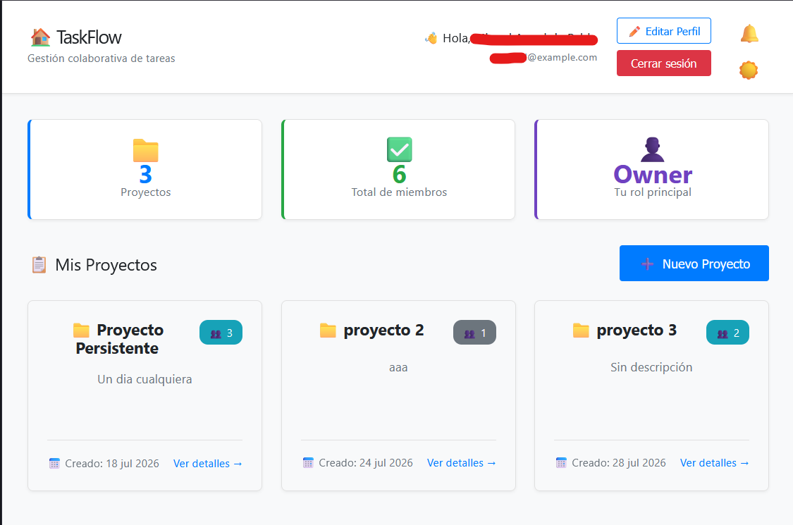
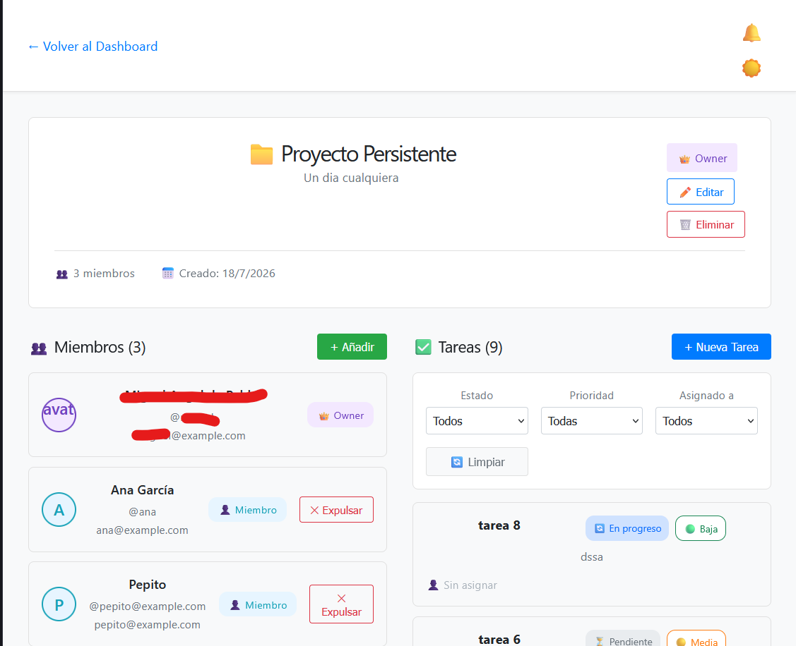
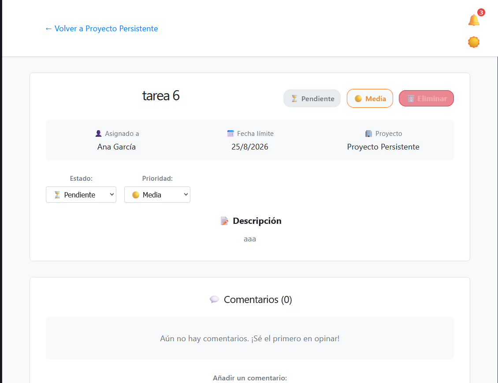
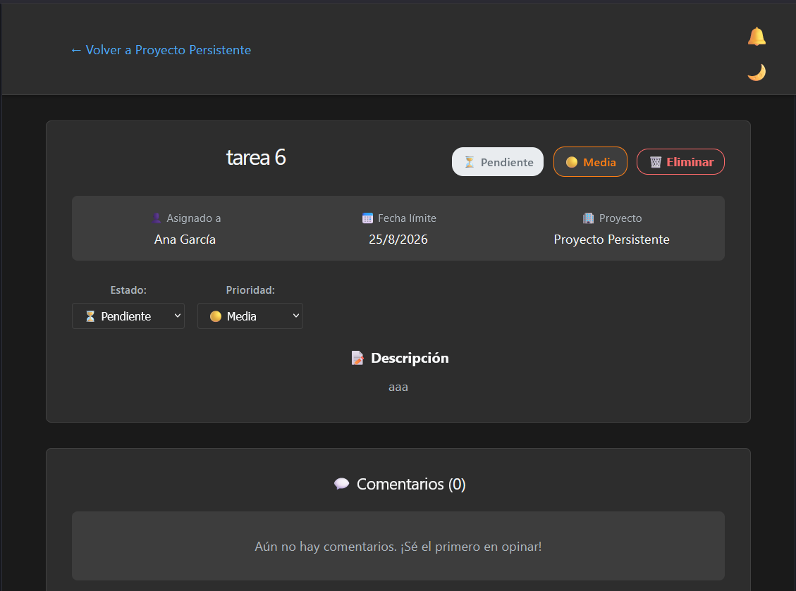

#  &nbsp;&nbsp;  🚀*TaskFlow - Gestión Colaborativa de Tareas*

**TaskFlow** es una aplicación web moderna para la gestión colaborativa de proyectos y tareas en tiempo real. Diseñada para equipos que necesitan coordinar trabajo de manera eficiente, con una interfaz intuitiva y funcionalidades de comunicación instantánea.

## 📋 Tabla de Contenidos

- [Características Principales](#-características-principales)
- [Capturas de Pantalla](#-capturas-de-pantalla)
- [Requisitos Técnicos](#-requisitos-técnicos)
- [Uso de la Aplicación](#-uso-de-la-aplicación)
- [Estructura del Proyecto](#-estructura-del-proyecto)
- [Tecnologías Utilizadas](#-tecnologías-utilizadas)
- [Despliegue](#-despliegue)
- [Contribución](#-contribución)
- [Licencia](#-licencia)

## ✨ Características Principales

### Gestión de Proyectos
- 📁 Crear, editar y eliminar proyectos
- 👥 Gestión de miembros con roles (Owner, Admin, Miembro)
- 📊 Estadísticas en tiempo real
- 🔍 Búsqueda y filtrado avanzado

### Gestión de Tareas
- ✅ Crear, actualizar y eliminar tareas
- 🎯 Asignación de tareas a miembros del equipo
- 🏷️ Sistema de prioridades (Baja, Media, Alta)
- 📅 Fechas límite con recordatorios visuales
- 🔄 Cambio de estado en tiempo real (Pendiente, En Progreso, Completada)

### Comunicación en Tiempo Real
- 💬 Sistema de comentarios en tareas
- 🔔 Notificaciones instantáneas vía WebSockets
- 👁️ Actualizaciones en vivo sin recargar la página
- 📢 Sincronización automática entre todos los miembros

### Seguridad y Autenticación
- 🔐 Autenticación JWT (JSON Web Tokens)
- 🛡️ Protección de rutas privadas
- 👤 Gestión de perfiles de usuario
- 🌙 Modo oscuro/claro con persistencia

### Experiencia de Usuario
- 📱 Diseño 100% responsive (móvil, tablet, desktop)
- 🎨 Interfaz moderna con CSS Variables
- ⚡ Carga rápida con Vite
- 🔄 Transiciones suaves y animaciones

## 📸 Capturas de Pantalla

### Dashboard Principal

*Vista general de todos tus proyectos con estadísticas en tiempo real*

### Detalle de Proyecto

*Gestión de miembros y tareas con filtros avanzados*

### Detalle de Tarea

*Vista completa de una tarea con comentarios y actualizaciones en vivo*

### Modo Oscuro

*Interfaz optimizada para trabajo nocturno*

## 🔧 Requisitos Técnicos

### Backend
- **Python**: 3.10 o superior
- **Base de datos**: SQLite (desarrollo) / PostgreSQL (producción)
- **Puerto**: 5000

### Frontend
- **Node.js**: 18 o superior
- **npm**: 9 o superior
- **Puerto**: 5173 (Vite dev server)

### Navegadores Soportados
- Chrome/Edge 90+
- Firefox 88+
- Safari 14+

## 📖 Uso de la Aplicación

### 1. Registro de Usuario

1. Accede a la aplicación web
2. Haz clic en "Regístrate aquí"
3. Completa el formulario con:
   - Username (único)
   - Email (único)
   - Contraseña (mínimo 6 caracteres)
   - Nombre completo (opcional)
4. Serás redirigido automáticamente al Dashboard

### 2. Crear tu Primer Proyecto

1. En el Dashboard, haz clic en "➕ Nuevo Proyecto"
2. Ingresa el nombre del proyecto (obligatorio)
3. Añade una descripción (opcional)
4. Haz clic en "✨ Crear Proyecto"
5. Serás redirigido a la página de detalle del proyecto

### 3. Invitar Miembros

1. En la página del proyecto, haz clic en "+ Añadir" en la sección de Miembros
2. Busca usuarios por username, email o nombre completo
3. Haz clic en "+ Añadir" junto al usuario deseado
4. El usuario recibirá una notificación en tiempo real

### 4. Crear Tareas

1. En la página del proyecto, haz clic en "+ Nueva Tarea"
2. Completa los campos:
   - Título (obligatorio)
   - Descripción (opcional)
   - Prioridad (Baja, Media, Alta)
   - Fecha límite (opcional)
   - Asignar a (opcional)
3. Haz clic en "✨ Crear Tarea"
4. La tarea aparecerá instantáneamente para todos los miembros

### 5. Gestionar Tareas

- **Cambiar estado**: Usa el selector de estado en la página de detalle
- **Añadir comentarios**: Escribe en el formulario de comentarios al final de la tarea
- **Editar tarea**: Haz clic en el icono ✏️ en la lista de tareas
- **Eliminar tarea**: Haz clic en "🗑️ Eliminar" en la página de detalle

### 6. Notificaciones

- La campana 🔔 en el header muestra notificaciones en tiempo real
- Haz clic en una notificación para navegar a la tarea/proyecto relacionado
- Las notificaciones se marcan como leídas automáticamente al abrirlas

## 🗂️ Estructura del Proyecto
    taskflow/
    ├── backend/
    │   ├── app/
    │   │   ├── init.py              # Inicialización de Flask
    │   │   ├── config.py            # Configuración por entorno
    │   │   ├── models.py            # Modelos SQLAlchemy
    │   │   ├── socket_handlers.py   # Eventos WebSocket
    │   │   └── routes/              # Endpoints de la API
    │   │       ├── auth.py          # Autenticación
    │   │       ├── projects.py      # Gestión de proyectos
    │   │       ├── tasks.py         # Gestión de tareas
    │   │       ├── users.py         # Gestión de usuarios
    │   │       └── comments.py      # Gestión de comentarios
    │   ├── migrations/              # Migraciones de base de datos
    │   └── requirements.txt         # Dependencias Python
    │
    ├── frontend/
    │   ├── src/
    │   │   ├── components/          # Componentes React reutilizables
    │   │   ├── context/             # Context API (Auth, Socket, Theme)
    │   │   ├── hooks/               # Custom hooks
    │   │   ├── pages/               # Páginas principales
    │   │   ├── services/            # Llamadas a la API
    │   │   └── styles/              # CSS y temas
    │   ├── public/                  # Assets estáticos
    │   └── package.json             # Dependencias Node.js
    │
    └── README.md                    # Este archivo

## 🛠️ Tecnologías Utilizadas

### Backend
- **Flask**: Framework web ligero y flexible
- **Flask-SQLAlchemy**: ORM para base de datos
- **Flask-Migrate**: Migraciones de base de datos
- **Flask-JWT-Extended**: Autenticación con JWT
- **Flask-SocketIO**: WebSockets para tiempo real
- **Flask-CORS**: Manejo de Cross-Origin Resource Sharing
- **SQLite/PostgreSQL**: Base de datos

### Frontend
- **React 18**: Biblioteca de interfaces de usuario
- **Vite**: Build tool ultrarrápido
- **React Router**: Enrutamiento SPA
- **Context API**: Gestión de estado global
- **Socket.io-client**: Cliente de WebSockets
- **Axios**: Cliente HTTP
- **CSS Variables**: Sistema de temas dinámico

### Herramientas de Desarrollo
- **ESLint**: Linter de JavaScript
- **Prettier**: Formateador de código
- **Git**: Control de versiones

## 🤝 Contribución

Las contribuciones son bienvenidas. Para contribuir:

1. Haz un fork del proyecto
2. Crea una rama para tu feature (`git checkout -b feature/AmazingFeature`)
3. Commit tus cambios (`git commit -m 'Add some AmazingFeature'`)
4. Push a la rama (`git push origin feature/AmazingFeature`)
5. Abre un Pull Request

### Guías de Contribución

- Sigue el estilo de código existente
- Añade comentarios siguiendo el estándar `// PROPÓSITO` / `// CRÍTICO`
- Escribe tests para nuevas funcionalidades
- Actualiza la documentación si es necesario

## 📄 Licencia

Este proyecto está bajo la Licencia MIT. Ver el archivo `LICENSE` para más detalles.

## 📞 Soporte

Si tienes preguntas o necesitas ayuda:

- 🐛 Issues: [GitHub Issues](https://github.com/MiguelAdePablo/taskflow/issues)
- 💬 Discussions: [GitHub Discussions](https://github.com/MiguelAdePablo/taskflow/discussions)

## 🙏 Agradecimientos

- [Flask](https://flask.palletsprojects.com/) - Framework backend
- [React](https://reactjs.org/) - Biblioteca frontend
- [Socket.io](https://socket.io/) - WebSockets
- [Vite](https://vitejs.dev/) - Build tool
- [Render](https://render.com/) - Hosting backend
- [Vercel](https://vercel.com/) - Hosting frontend

---

